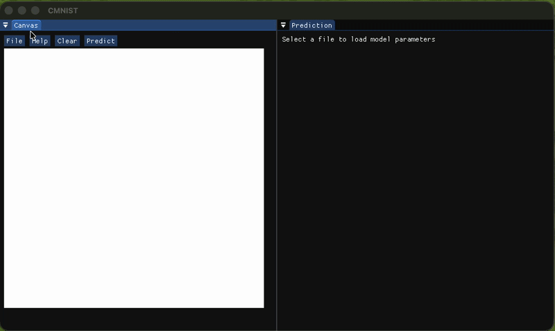

# CMNIST-GUI

A small graphical frontend for the [**CMNIST**](https://github.com/Beginner10617/CMNIST.git) handwritten digit recognition project, built using **C++**, **Dear ImGui**, **SDL2**, and **OpenGL 3**.

The goal of this project is to provide an interactive interface where users can draw handwritten digits and have them classified using the neural network implementation from the original CMNIST project, which is written entirely in C.

## Features

* Dear ImGui based graphical interface
* Reuses the existing C implementation of the neural network
* Single executable combining C and C++ code

## Project Structure

```text
.
├── build/          # Object files (ignored by git)
├── cmnist/         # Original C implementation
├── imgui/          # Dear ImGui source
├── SDL/            # SDL2 source
├── bash/           # Bash scripts for build
├── main.cpp        # GUI entry point
├── build_mac.sh    # Bash script to build and link to (my local) mac environment
├── FORMAT.txt      # Format description for model parameter files (if u want to add your own)
├── model.txt       # Trained neural network weights and biases
├── DEMO.gif        # A demo of the gui application
└── README.md       # README u r reading rn
```

## Requirements

- C/C++ compiler (clang or g++)
- Git
- zsh/bash
  
## Build

The project is currently configured to build on **macOS** using the provided shell scripts.
Before building, ensure that a C/C++ toolchain (clang/g++) and the required development tools are installed.

Run the following scripts from the project root:

```bash
source bash/build_imgui.sh   # Build Dear ImGui
source bash/build_sdl2.sh    # Build SDL2
source bash/compile_c.sh     # Compile the C backend
source bash/compile_cpp.sh   # Compile the C++ frontend
source bash/link_mac.sh      # Link the final executable
```

Alternatively, build everything in one step:

```bash
source build_mac.sh
```

> **Note:** `link_mac.sh` links against macOS system frameworks and is therefore **macOS-specific**. To build on Linux or Windows, replace the linking step with the appropriate platform-specific libraries and linker flags.

## Demo
<div align="center">

</div>
